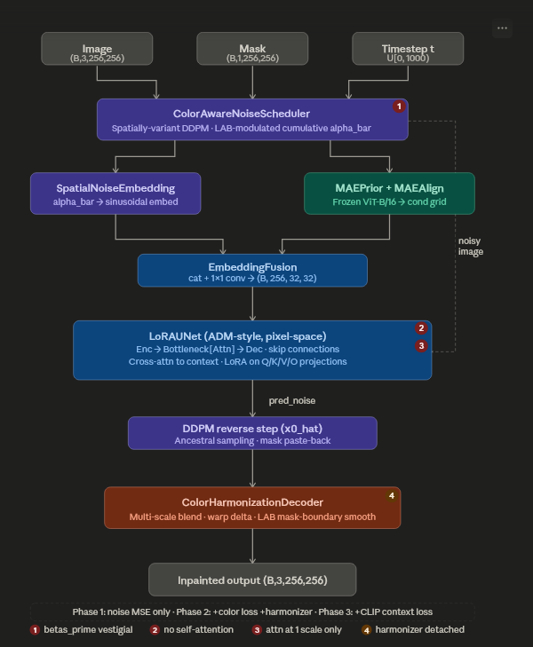

# COLORAD (Color-Aware Region Diffusion)

> This project is currently under active development as part of a Research Internship at IIT Bhilai. The repository will be updated regularly with new experiments, model improvements, and evaluation results.

## Overview

COLORAD (Color-Aware Region Diffusion) is a diffusion-based image inpainting framework developed during a Research Internship at IIT Bhilai. The model is designed to reconstruct missing or corrupted facial regions while preserving semantic consistency, structural realism, and color harmony.

The framework integrates color-aware diffusion scheduling, MAE-guided contextual priors, LoRA-enhanced U-Net denoising, and a dedicated color harmonization decoder to generate realistic inpainted facial images.

---

## Research Association

This research is being conducted as part of a Research Internship at IIT Bhilai in the field of Generative AI and Computer Vision.
---

## Dataset

### FFHQ Dataset

- Dataset: Flickr-Faces-HQ (FFHQ)
- Total Images: ~70,000
- Dataset Size: ~90 GB
- Resolution Used: 256 × 256
- Domain: High-quality human face images

Due to GitHub storage limitations, the dataset is not included in this repository.

Download FFHQ from:
https://www.kaggle.com/datasets/gibi13/flickr-faces-hq-dataset-ffhq

---

## COLORAD Architecture

  

*Figure: Overview of the proposed COLORAD framework, integrating color-aware diffusion scheduling, MAE-guided contextual conditioning, LoRA-enhanced U-Net denoising, and color harmonization.*

---

### Core Components

#### 1. Color-Aware Noise Scheduler
- Spatially variant DDPM scheduler
- LAB-modulated cumulative alpha values
- Color-sensitive noise scheduling

#### 2. Spatial Noise Embedding
- Converts diffusion statistics into sinusoidal embeddings
- Preserves spatial noise characteristics

#### 3. MAE Prior + MAE Alignment
- Frozen ViT-B/16 backbone
- Context-aware feature extraction
- Semantic guidance for reconstruction

#### 4. Embedding Fusion
- Combines scheduler embeddings and contextual priors
- Generates unified conditioning features

#### 5. LoRA U-Net (ADM Style)
- Encoder-decoder architecture
- Attention bottleneck
- LoRA-enhanced cross-attention projections
- Skip connections for detail preservation

#### 6. DDPM Reverse Sampling
- Progressive denoising
- Mask paste-back strategy

#### 7. Color Harmonization Decoder
- Multi-scale blending
- LAB-space color refinement
- Boundary smoothing

#### 8. Final Inpainted Output
- Realistic facial reconstruction
- Improved color consistency

---

## Key Features

- Diffusion-based image inpainting
- Color-aware denoising process
- MAE-guided contextual conditioning
- LoRA-enhanced attention mechanism
- LAB-space color harmonization
- High-quality face restoration
- Multi-stage training pipeline

---

## Technologies Used

- Python
- PyTorch
- Diffusion Models (DDPM)
- LoRA
- Vision Transformers (ViT)
- MAE (Masked Autoencoder)
- OpenCV
- NumPy
- Matplotlib

---

## Results

Training and evaluation are currently ongoing on the FFHQ dataset. Preliminary experiments demonstrate promising performance in context-aware facial image inpainting, structural preservation, and color harmonization. Comprehensive quantitative evaluation is currently in progress.

---

## Future Work

- Extending the framework to higher-resolution image generation
- Improving semantic consistency in large masked regions
- Optimizing inference efficiency
- Conducting detailed evaluation using FID, LPIPS, PSNR, and SSIM metrics
- Exploring advanced diffusion-based conditioning strategies

---

## Author

**Rishik T**

B.Tech, Electrical and Electronics Engineering  
National Institute of Technology Andhra Pradesh

Research Intern, IIT Bhilai

---

## Acknowledgements

- IIT Bhilai Research Internship Program
- FFHQ Dataset Contributors
- PyTorch Community
- Open-source Computer Vision Research Community

---